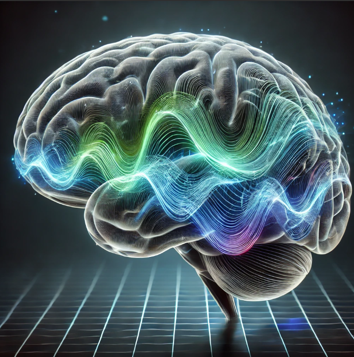

# Multi-Patient Alzheimer's EEG Dataset

   

## Overview

The Multi-Patient Alzheimer's EEG Dataset provides EEG signals recorded from 35 patients over a duration of 2 minutes each. The dataset includes signals from four key electrodes: `TP9`, `AF7`, `AF8`, and `TP10`. The data is structured to facilitate research and learning in Alzheimer's detection, offering time-series recordings with labeled diagnosis information.

---

## Dataset Details

    

- **Number of Patients**: 32
- **Recording Duration**: 2 minutes per patient
- **Sampling Rate**: 256 Hz
- **Electrodes**:
  - `TP9`
  - `AF7`
  - `AF8`
  - `TP10`
- **Signals**: Raw EEG signals for each electrode
- **Labels**: 
  - `1`: Alzheimer's Diagnosis
  - `0`: Healthy

---

## File Structure

### Columns in the Dataset
1. **Patient_ID**: Unique identifier for each patient (e.g., `Patient_1`, `Patient_2`).
2. **Time**: Time in seconds for the recording.
3. **TP9_signal**: EEG signal recorded from the TP9 electrode.
4. **AF7_signal**: EEG signal recorded from the AF7 electrode.
5. **AF8_signal**: EEG signal recorded from the AF8 electrode.
6. **TP10_signal**: EEG signal recorded from the TP10 electrode.
7. **Diagnosis**: Binary label indicating the presence (`1`) or absence (`0`) of Alzheimer's disease.

---

## Purpose

This dataset is intended for **educational purposes only**. It is designed to support research, learning, and development of methods in EEG signal processing and Alzheimer's detection. It may be used for:
- Exploring EEG signal analysis techniques.
- Training and validating machine learning models.
- Demonstrating feature extraction and signal processing workflows.

---

## Usage

### Potential Applications
- Alzheimer's disease detection using machine learning.
- EEG signal processing and analysis.
- Feature extraction for brain activity studies.

### Recommended Preprocessing Steps
1. **Filtering**: Apply band-pass filters to remove noise outside the EEG frequency range (e.g., 0.5-50 Hz).
2. **Feature Extraction**: Compute features like power spectral density, mean amplitude, or wavelet coefficients.
3. **Segmentation**: Segment signals into smaller time windows for detailed analysis.

### Example Workflow
1. Load the dataset into your preferred analysis tool (e.g., Python, MATLAB).
2. Preprocess the signals to enhance data quality.
3. Train and validate machine learning models using the signals and labels.

